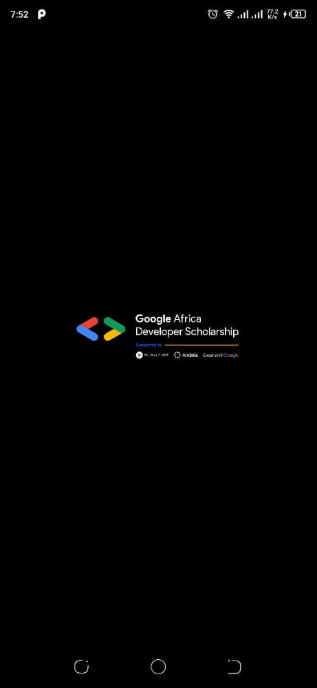
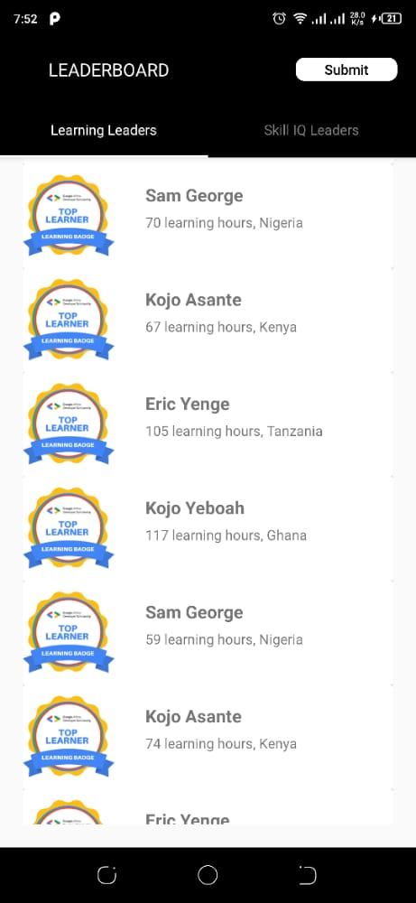
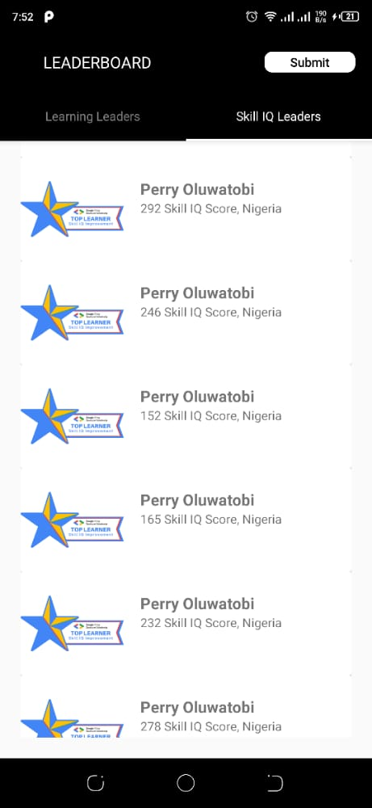
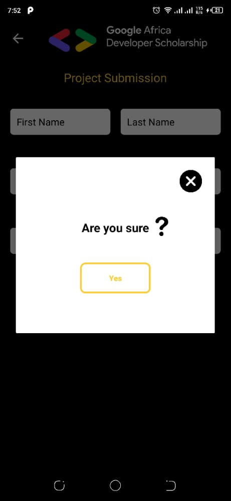
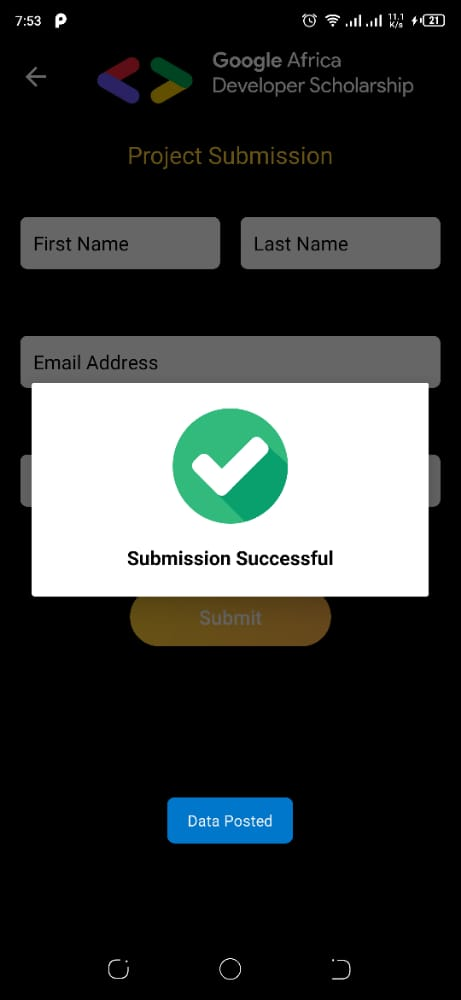
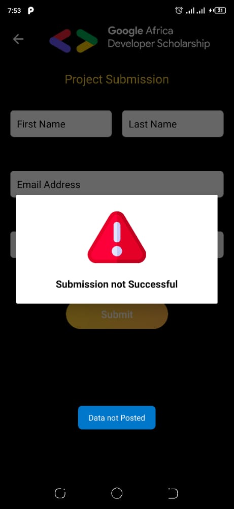

# GADs LeadersBoard
## Associate Android Developer Practice Project (GADS 2020)

Timeline: Friday, Aug 28 - Friday, Sept 11 2020 (2 weeks)

Building a GADS Leaderboard Mobile Application

## Description

This project is a very simple Android Project aimed at getting you to implement some simple concepts that are very important as far as Android Development is concerned.

In this project, you are going to implement a mobile design of the GADS 2020 Leaderboard.
The mobile App will display Top 20 learners in the Learning Leaders’ category and Top 20 learners in the Skill IQ Leaders’ category.

## API Endpoints

- Base URL - https://gadsapi.herokuapp.com/
- Learning Leaders - /api/hours
- Skill IQ Leaders - /api/skilliq

## Submission

The submission will be done through your App. 
To submit your project, you are expected to;

Make a NETWORK POST request to this Google Form using any network library. [Retrofit is recommended.]
- Base url - https://docs.google.com/forms/d/e/
- Form ID-1FAIpQLSf9d1TcNU6zc6KR8bSEM41Z1g1zl35cwZr2xyjIhaMAz8WChQ/formResponse
- FullURL- https://docs.google.com/forms/d/e/1FAIpQLSf9d1TcNU6zc6KR8bSEM41Z1g1zl35cwZr2xyjIhaMAz8WChQ/formResponse
### Entries IDs:
- Email Address = entry.1824927963
- Name = entry.1877115667
- Last Name = entry.2006916086
- Link to project = entry.284483984

## Tech stack
 - MVVM (ViewModel, LiveData, Repository)
 - Retrofit
 - Recyclerview
 - Tablayout
 - Google form
 
 ## Demo

  
  
  
  
  
  

